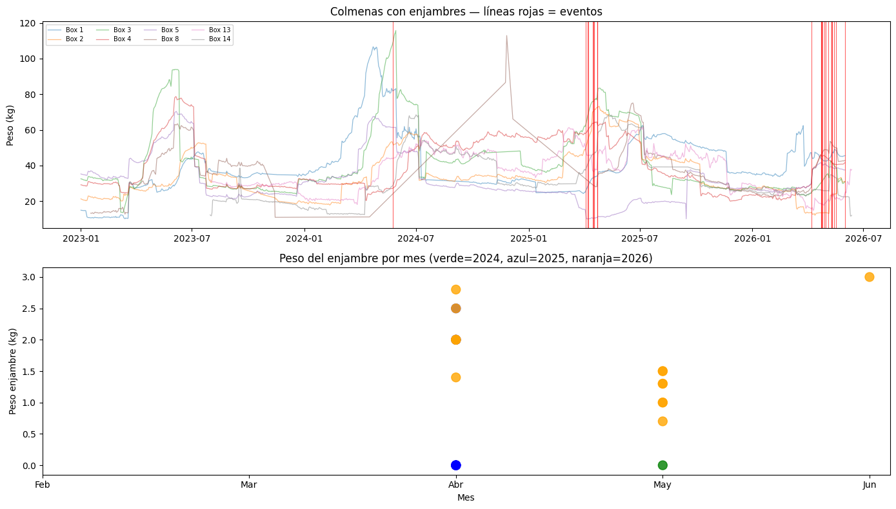
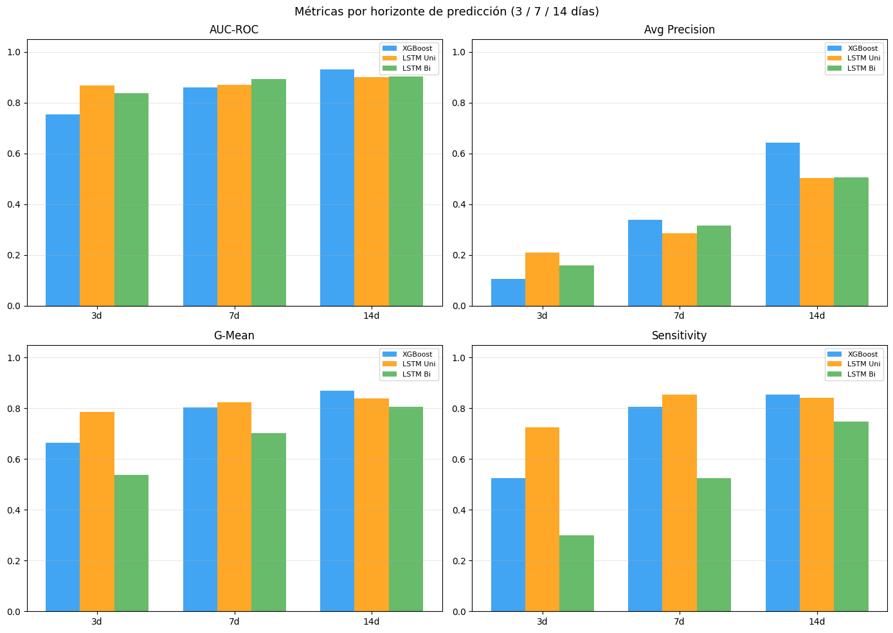
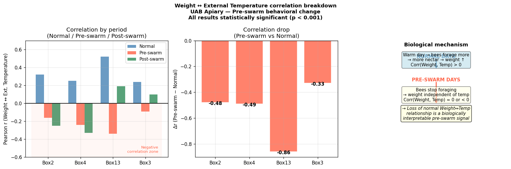
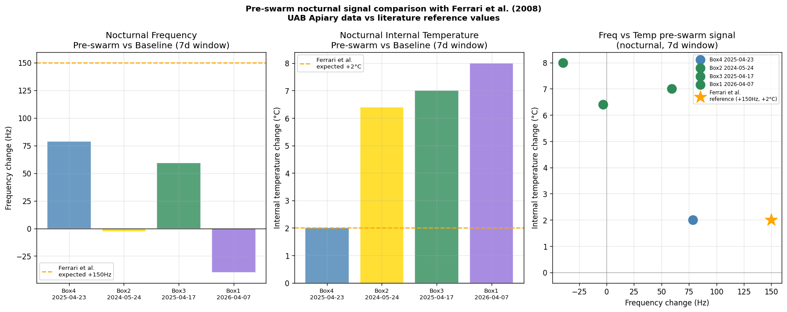

# TFG — Early Detection of Swarming Events in Honey Bee Colonies

**Author:** Miguel Arpa Robig  
**Supervisor:** Vicenç Soler Ruíz (Dept. Microelectrònica i Sistemes Electrònics, UAB)  
**Degree:** Final Degree Project — Artificial Intelligence, Escola d'Enginyeria (UAB)  
**Academic year:** 2025/26

---

## Overview

This project develops a machine learning system for early prediction of swarming events in honey bee colonies using continuous multi-sensor IoT data from the UAB campus apiary. It covers 8 instrumented hives over three seasons (2023–2026) with 23 confirmed swarming events.



**Main contributions:**
- Behavioural analysis identifying pre-swarm weight–temperature correlation breakdown (~7 days before departure), validated as statistically significant (p < 0.001) across hives
- Nocturnal signal validation against Ferrari et al. (2008) reference values
- `weight_std_roll14` (14-day rolling std of daily weight) identified as a high-value engineered feature via ablation study — improves XGBoost AUC by up to +0.053
- XGBoost + Optuna classifiers with morning-window (10–14h) and overnight (22–7h) features, compared against **LSTM (uni- and bidirectional)** sequence models
- Multi-horizon prediction at 3, 7, and 14 days
- Event-level evaluation (swarms detected vs. false alarms), not just aggregate AUC/AP
- Exploratory honey super (alza) placement prediction model

**Best result:** LSTM (unidirectional) on `03_swarm_night_enhanced` — **AUC = 0.887, 13/14 test events detected, 218 false alarms.** LSTM architectures outperform XGBoost on every metric in both main model notebooks.

---

## Repository Structure

```
TFG_Bees/
├── notebooks/
│   ├── exploratory/                       # Preliminary behavioural studies
│   │   ├── 01_eda_seasonal.ipynb              EDA: seasonal & intraday patterns
│   │   ├── 02_instability_index.ipynb         Pre-swarm instability index
│   │   ├── 03_nocturnal_signals.ipynb         Nocturnal pre-swarm signal analysis
│   │   └── 04_external_disturbance.ipynb      External disturbance detection (18/04 event)
│   └── models/                            # Predictive models
│       ├── 01_swarm_multihorizon.ipynb        XGBoost + LSTM at 3/7/14-day horizons
│       ├── 02_swarm_morning_window.ipynb      Morning-window XGBoost vs LSTM Uni/Bi
│       ├── 03_swarm_night_enhanced.ipynb      + nocturnal features (best overall model)
│       └── 04_honey_super.ipynb               Honey super placement prediction
├── docs/
│   └── images/                            # Result figures (extracted from notebook outputs)
├── data/                                  # NOT in git — place CSV here (see below)
│   └── .gitkeep
├── plots/                                 # NOT in git — generated at runtime
│   └── .gitkeep
├── .gitignore
├── requirements.txt
└── README.md
```

---

## Data Setup

Raw sensor data is **not included** in this repository (files are 150–220 MB).

Place the unified CSV file in the `data/` folder:

```
data/
└── 12062026all_boxes.csv     # Full dataset: all hives, Feb 2023 – Jun 2026
```

The notebook `01_swarm_multihorizon.ipynb` additionally requires a preprocessed daily features file:

```
data/
└── daily_data.csv            # Pre-computed daily aggregates (generated by 01_eda_seasonal.ipynb)
```

**CSV format** (columns):

| Column | Description |
|---|---|
| `Hive name` | Box identifier (integer 1–18) |
| `Time` | Timestamp (datetime) |
| `Weight` | Hive weight (kg) |
| `Frequency` | Acoustic frequency (Hz) |
| `Volume` | Acoustic volume |
| `Temperature heart` | Internal temperature (°C) |
| `Humidity heart` | Internal humidity (%) |
| `Temperature scale` | External temperature (°C) |
| `Humidity scale` | External humidity (%) |

---

## Notebooks Guide

### Exploratory (run first)

| Notebook | Description | Key output |
|---|---|---|
| `01_eda_seasonal.ipynb` | Seasonal weight cycles, intraday foraging patterns, thermoregulation analysis | `daily_data.csv` |
| `02_instability_index.ipynb` | Rolling variability index combining temp, activity, weight | Instability time-series around events |
| `03_nocturnal_signals.ipynb` | Night frequency/temperature vs Ferrari et al. (2008); weight↔temperature correlation breakdown | `literature_comparison.png`, `correlation_breakdown.png` |
| `04_external_disturbance.ipynb` | 18/04/2026 UAB festival anomaly — cross-hive cross-correlation analysis | Cross-correlation plots per hive |

### Models (run after exploratory)

| Notebook | Description | Best result |
|---|---|---|
| `01_swarm_multihorizon.ipynb` | XGBoost + LSTM Uni/Bi at 3, 7, 14-day horizons | AUC up to 0.931 (XGBoost, 14d) |
| `02_swarm_morning_window.ipynb` | Morning-window (10–14h) features + `weight_std_roll14`, XGBoost vs LSTM Uni/Bi | **LSTM Bi: AUC=0.863, 13/14 events, 247 false alarms** |
| `03_swarm_night_enhanced.ipynb` | Adds 13 nocturnal features (22–7h) from raw readings | **LSTM Uni: AUC=0.887, 13/14 events, 218 false alarms** (best overall) |
| `04_honey_super.ipynb` | Honey super placement prediction (secondary task) | XGBoost + LSTM comparison |

Each model notebook follows the same structure: data loading → feature engineering → **Model A** (XGBoost, 3-day horizon, baseline vs `weight_std_roll14`) → **Model A-LSTM** (Uni/Bi on the same features) → **Model B** (same-day anomaly detection) → walk-forward validation → event-level comparison table (Section 7.2: swarms detected / false alarms for all 4 models) → Optuna hyperparameter search.

---

## Methods

- **Features:** 15-min resampled data, `ffill(limit=8)`, morning aggregations (10–14h), overnight aggregations (22–7h) from raw readings, `weight_std_roll14` (14-day rolling std of daily mean weight)
- **Target:** `target_3d = 1` if swarm event in [D+1, D+2, D+3]
- **Class imbalance:** `scale_pos_weight` (XGBoost) / weighted `BCEWithLogitsLoss` (LSTM), inversely proportional to positive-class frequency (~0.8–4% depending on split)
- **Sequence models:** LSTM (uni- and bidirectional, 2 layers, hidden=64), 14-day input sequences, early stopping on validation loss
- **Optimisation:** Optuna, 50 trials, TPE sampler, maximising walk-forward Average Precision (XGBoost only)
- **Evaluation:** Walk-forward cross-validation (train < year Y → test year Y), AUC-ROC, Average Precision, G-Mean, and **event-level detection** (swarms detected / total, false alarm count)

**Missing data handling:** raw sensor gaps ≤ 2h are forward-filled (`ffill(limit=8)`); longer gaps are left as NaN rather than invented. Rolling/lag features (`corr_w_temp`, moving averages, etc.) are NaN at the start of each hive's history by construction. Any feature with >50% missing values across the dataset is dropped entirely rather than imputed. For the remaining NaNs: XGBoost inputs are imputed with the **median computed on the training split only** (no leakage into the train statistic, and robust to outliers, unlike mean); LSTM inputs are z-score standardised first (`StandardScaler` fit on train) and then filled with 0, which is the neutral/mean value post-standardisation. `days_since_swarm` is the one exception — it is filled with a sentinel (999) plus a companion binary flag `has_prior_swarm`, since "no prior swarm" is qualitatively different from "a long time ago." Rows are only dropped outright when no feature value exists for that day at all (e.g. Model B's same-day anomaly score needs that day's morning-window data to exist).

**Feature ablation finding:** of 7 candidate signals tested (4 nocturnal-temperature variants, correlation-breakdown count, temp↔humidity correlation, weight variability), only `weight_std_roll14` improved results consistently across both XGBoost and LSTM models in both notebooks — it is the only one kept in the final feature set. Narrowing the morning window from 10–14h to 12–14h was also tested and rejected (more false alarms, no consistent gain).

---

## Requirements

```bash
pip install -r requirements.txt
```

**Key dependencies:** `pandas`, `numpy`, `xgboost`, `optuna`, `torch`, `scikit-learn`, `matplotlib`, `seaborn`, `scipy`, `joblib`

---

## Results Summary

### Model A (3-day horizon) — XGBoost vs LSTM, all 4 variants

| Model | Notebook | AUC | AP | G-Mean | Sens | Spec | Swarms detected | False alarms |
|---|---|---|---|---|---|---|---|---|
| XGBoost baseline | 02 | 0.649 | 0.117 | 0.630 | 0.650 | 0.611 | 11/14 | 370 |
| XGBoost + `weight_std_roll14` | 02 | 0.681 | 0.124 | 0.673 | 0.600 | 0.755 | 10/14 | 233 |
| LSTM Uni | 02 | 0.817 | 0.133 | 0.761 | 0.850 | 0.681 | 13/14 | 303 |
| **LSTM Bi** | 02 | **0.863** | **0.150** | **0.816** | 0.900 | 0.740 | **13/14** | 247 |
| XGBoost baseline | 03 | 0.711 | 0.124 | 0.668 | 0.775 | 0.576 | 12/14 | 403 |
| XGBoost + `weight_std_roll14` | 03 | 0.717 | 0.141 | 0.715 | 0.650 | 0.787 | 10/14 | 202 |
| **LSTM Uni** | 03 | **0.887** | **0.160** | **0.844** | 0.925 | 0.771 | **13/14** | **218** |
| LSTM Bi | 03 | 0.789 | 0.092 | 0.743 | 0.700 | 0.789 | 10/14 | 200 |

**LSTM consistently beats XGBoost** on AUC, AP, G-Mean and events detected, in both notebooks. The best single model is **LSTM Uni on `03_swarm_night_enhanced`** (highest AUC, tied-best event detection, fewest false alarms among the 13/14-event models).

### Multi-horizon (`01_swarm_multihorizon.ipynb`)



XGBoost reaches the highest AUC at longer horizons (0.931 at 14d), but LSTM models are competitive or better at the 3-day horizon, which is the operationally relevant one for early warning.

### Behavioural finding: weight↔temperature correlation breakdown



Bees stop responding to external temperature in the week before swarming — the normal positive correlation between weight and temperature collapses or reverses (p < 0.001 across all hives tested).

### Nocturnal signal validation vs literature



UAB apiary nocturnal signals show the same *direction* of change as Ferrari et al. (2008) (frequency ↑, internal temperature ↑ before swarming) but smaller magnitude — consistent with the lower spectral resolution of the microphone-based sensors used here vs. accelerometer-based systems in the literature.

---

## Swarming Events Dataset

| Hive | Swarms | Period |
|---|---|---|
| Box1 | 2 | Apr 2026 |
| Box2 | 1 | May 2024 |
| Box3 | 3 | Apr 2025 |
| Box4 | 3 | Apr 2025 |
| Box5 | 2 | Apr–May 2026 |
| Box8 | 4 | Apr–May 2025–26 |
| Box13 | 4 | Apr 2025 |
| Box14 | 4 | Apr–May 2025–26 |
| **Total** | **23** | 2023–2026 |

---

## Citation

If you use this work, please cite:

```
Arpa Robig, M. (2026). Multi-Sensor Analysis and Early Detection of Swarming Events
in Honey Bee Colonies Using Machine Learning. Final Degree Project in Artificial
Intelligence, Universitat Autònoma de Barcelona.
```
